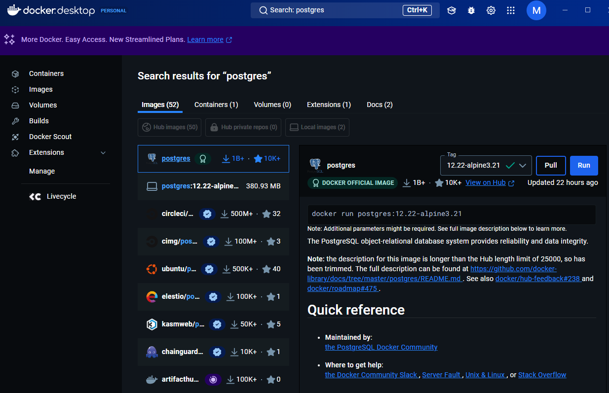

# DOCUS

- initialization of the overall application, simple installation and setup for frontend components
- setup ORM and Supabase
  - install prisma (`npm install @prisma/client`)
  - setup prisma (env setup)
  - run migrations (`npx prisma db push`)
  - run dev migration (`npx prisma migrate dev`)
  - see prisma db (`npx prisma studio`)
- auth setup (todo)

## Stack

- NextJs
- Prisma
- Supabase / Local (Postgress) / Docker (Postgress)

## Setup

- pnpm i
- pnpm prisma generate
- pnpm add prisma @prisma/client
- pnpm update prisma @prisma/client

## TODO

Feature Checklist for Development

1. Centralized Digital Repository
   - [/] Create a database schema to store civil registry documents securely.
   - [ ] Implement search functionality with filtering options for quick document retrieval.
   - [ ] Support multiple document formats (e.g., PDF, images, scanned files).

2. Automated Document Classification
   - [ ] Develop logic to categorize documents by type, date, and unique identifiers.
   - [ ] Automate tagging and reduce reliance on manual data entry.

3. Advanced Access Controls
   - [/] Implement role-based permissions for structured access.
   - [ ] Develop secure authentication mechanisms for accessing sensitive records.

4. Secure Backup and Recovery
   - [ ] Set up regular automated backups of the database.
   - [ ] Provide recovery mechanisms for uninterrupted service.

5. Compliance with Legal Standards
   - [ ] Ensure data management complies with the Philippine Data Privacy Act (RA 10173).
   - [ ] Add audit trail functionality for accountability and legal compliance.

6. Intuitive and User-Friendly Design
   - [ ] Design an easy-to-navigate interface requiring minimal training.
   - [ ] Add real-time dashboards for tracking document and system statuses.

7. Online Document Request and Approval
   - [ ] Build a request system for users to access virtual documents.
   - [ ] Automate approval workflows and show real-time updates for users.

8. Document Verification and Authentication
   - [ ] Implement digital signature and QR code functionality for document verification.
   - [ ] Build an instant validation mechanism for document authenticity.

9. Bulk Document Upload and Processing
   - [ ] Add batch upload functionality for processing multiple documents at once.
   - [ ] Automate metadata extraction and validation for uploaded files.

10. Integration with Government Systems
    - [ ] Develop APIs for integration with LGU systems (e.g., payment gateways, citizen portals).
    - [ ] Enable third-party system connectivity via secure APIs.

11. Reporting and Analytics
    - [ ] Create detailed reports for document requests, processing, and user activity.
    - [ ] Add visual dashboards for analytical insights and trends.

12. Multi-Language Support
    - [ ] Provide language options (e.g., English and Filipino) for the user interface.
    - [ ] Design localization features for easy expansion.

13. Notifications and Alerts
    - [ ] Enable email notifications for document status changes or deadlines.
    - [ ] Build a system for sending alerts for critical tasks.

14. Customizable Workflows
    - [ ] Add functionality to configure workflows for different office processes.
    - [ ] Implement a dynamic process editor for customization.

## Additional Features Checklist

1. Content Management System (CMS) for the Kiosk
   - [ ] Create a user-friendly interface for managing kiosk content.
   - [ ] Enable uploading, updating, and deleting kiosk materials (e.g., videos, banners, announcements).
   - [ ] Ensure real-time updates to kiosks with minimal downtime.
   - [ ] Backup data manually base on ROLE (primarily admin).

2. Restrict User Role from Logging In
   - [x] Prevent `USER` role from accessing the system through authentication.
   - [x] Add proper error messages to inform unauthorized users of access denial.

3. Queued Ticket Document Showcase
   - [ ] When a ticket is clicked, display a detailed view of required documents.
   - [ ] Implement an easy-to-read checklist format for required documents.
   - [ ] Enable dynamic updates if additional documents are required.

4. Document Management
   - [ ] Add CRUD functionality for managing civil registry documents.
   - [ ] Enable metadata tagging for easy categorization and search.
   - [ ] Support document versioning to keep track of changes.

5. Feedback System
   - [x] Allow `STAFF` and `ADMIN` roles to submit feedback through the system.
   - [x] Display feedback in a table format for easy review.
   - [x] Include filters to sort feedback by user.

6. User Profile Customization in Settings
   - [ ] BLANK

7. User Management
   - [ ] CRUD functionality
   - [ ] Distinguished Controls for Regular users and Admin can manage staff members

8. Citizen Portal
   - [ ] BLANK

## Docker + PGSQL

1. Download Docker Desktop
2. Download [Postgres](https://hub.docker.com/_/postgres) image from the hub.

3. [Documentation](https://www.docker.com/blog/how-to-use-the-postgres-docker-official-image/)
